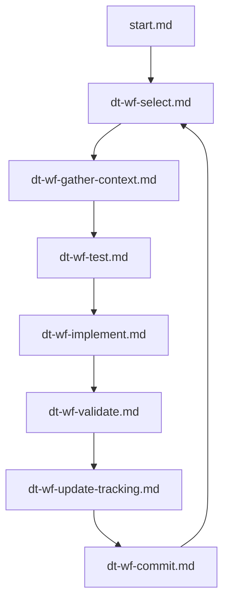

# dig-clvm — Operator Prompt



## Workflow Cycle

| Step | File | Action |
|------|------|--------|
| 0 | [start.md](start.md) | Sync, check tools, pick work |
| 1 | [dt-wf-select.md](tree/dt-wf-select.md) | Choose requirement from IMPLEMENTATION_ORDER |
| 2 | [dt-wf-gather-context.md](tree/dt-wf-gather-context.md) | Pack context (Repomix + SocratiCode), read specs |
| 3 | [dt-wf-test.md](tree/dt-wf-test.md) | Write failing test first (TDD) |
| 4 | [dt-wf-implement.md](tree/dt-wf-implement.md) | Implement — chia crates first, minimal own code |
| 5 | [dt-wf-validate.md](tree/dt-wf-validate.md) | Run tests, clippy, fmt |
| 6 | [dt-wf-update-tracking.md](tree/dt-wf-update-tracking.md) | Update TRACKING.yaml, VERIFICATION.md |
| 7 | [dt-wf-commit.md](tree/dt-wf-commit.md) | Commit, push, loop |

## Decision Tree

| File | Topic |
|------|-------|
| [dt-paths.md](tree/dt-paths.md) | Path conventions |
| [dt-role.md](tree/dt-role.md) | Operator role |
| [dt-hard-rules.md](tree/dt-hard-rules.md) | Non-negotiable rules |
| [dt-authoritative-sources.md](tree/dt-authoritative-sources.md) | Spec layout and traceability |
| [dt-tools.md](tree/dt-tools.md) | GitNexus, Repomix, SocratiCode |
| [dt-git.md](tree/dt-git.md) | Git workflow |

## Tool Index

| Tool | Purpose | Docs |
|------|---------|------|
| [SocratiCode](tools/socraticode.md) | Semantic codebase search, dependency graphs, cross-project queries | [GitHub](https://github.com/giancarloerra/socraticode) |
| [GitNexus](tools/gitnexus.md) | Knowledge graph, dependency analysis, impact checking | [npm](https://www.npmjs.com/package/gitnexus) |
| [Repomix](tools/repomix.md) | Context packing for LLM consumption | [repomix.com](https://repomix.com/) |

## Requirement Traceability

```
IMPLEMENTATION_ORDER.md  →  pick [ ] item
        ↓
NORMATIVE.md#PREFIX-NNN  →  read authoritative statement
        ↓
specs/PREFIX-NNN.md      →  read detailed specification
        ↓
implement + test         →  write code and VV tests
        ↓
VERIFICATION.md          →  update status (❌ → ✅)
TRACKING.yaml            →  update status, tests, notes
IMPLEMENTATION_ORDER.md  →  check off [x]
```
